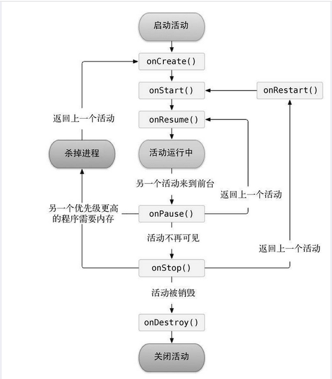

# 3.活动的生命周期

### 进入下一个活动和打开弹窗活动，生命周期变化区别:

D/MainActivity: onCreate:

D/MainActivity: onStart: 

D/MainActivity: onResume: 

D/MainActivity: onClick: 进入
NormalActivity

D/MainActivity: onPause: 

D/MainActivity: onStop: 

D/NormalActivity: 退出了NormalActivity

D/MainActivity: onRestart: 

D/MainActivity: onStart: 

D/MainActivity: onResume: 

D/MainActivity: onClick: 打开了DialogActivity

D/MainActivity: onPause: 

D/DialogActivity: 关闭了DialogActivity

D/MainActivity: onResume: 

D/MainActivity: onClick: 退出MainActivity

D/MainActivity: onPause: 

D/MainActivity: onStop: 

D/MainActivity: onDestroy: 

